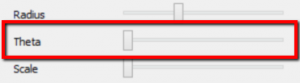

## Cylindrical Blender Controls
Last Updated: 5 years ago in [Indigo Tools](kb/indigo-tools/) [SDK development ](kb/sdk-development/)
- - -

Below we review the options available for the Cylindrical blender module, which forms a single image from all the sensors in the camera. The image is formed by projecting each of the sensor images onto a cylinder centered on the Y-axis, and quantizing to a fixed grid to form a 2D image of the unwrapped cylinder. This of course requires full calibration data for the sensors, so we know where they are relative to the cylinder.

When the camera is plugged in, you can click 

to open the camera configuration. The Blending section will show the cylindrical blender options when “Cylindrical” is selected as the Blender.
You can use use occamSetDeviceValues(device,OCCAM_BLENDER0,”cylb”) to programmatically enable cylindrical stitching if it is not already set. The actual output image will be produced when reading OCCAM_STITCHED_IMAGE0, OCCAM_STITCHED_IMAGE1, OCCAM_STITCHED_DISPARITY_IMAGE, etc. The set of outputs exposed that use the blender depends on the camera/driver.

### Radius

The radius option controls the radius of the cylinder that is drawn about the Y-axis. The main affect of this setting is to change parallax errors for objects that are closer or farther from the camera (objects landing exactly on the cylinder will have no blending errors). For objects past several meters, a very large radius should lead to the fewest blending errors. The units are in millimeters * 1000.

Use occamSetDeviceValuei(device,OCCAM_STITCHING_RADIUS,VALUE) to change this value.

### Theta

This value controls the position (angle) on the cylinder that is used as the started of the unwrapping. It varies from 0 to 360 degrees, and changes where the left edge of the resulting image corresponds to on the cylinder.

Use occamSetDeviceValuei(device,OCCAM_STITCHING_ROTATION,VALUE) to change this value.

### Scale

The scale option changes the width of the resulting image relative to the height. The units are in scale * 1000, where scale of 2 means width = original_width/2, height = original_height.
 
Use occamSetDeviceValuei(device,OCCAM_STITCHING_SCALEWIDTH,VALUE) to change this value.
 
### Crop

The crop option should be zero or one, and indicates whether to crop the resulting image so that there are no jagged edges on the top/bottom of the image. Typically sensors are not exactly aligned on the X-Z plane, which leads to a trade-off of wasted image vs jagged edges.

Use occamSetDeviceValuei(device,OCCAM_STITCHING_CROP,VALUE) to change this value.
